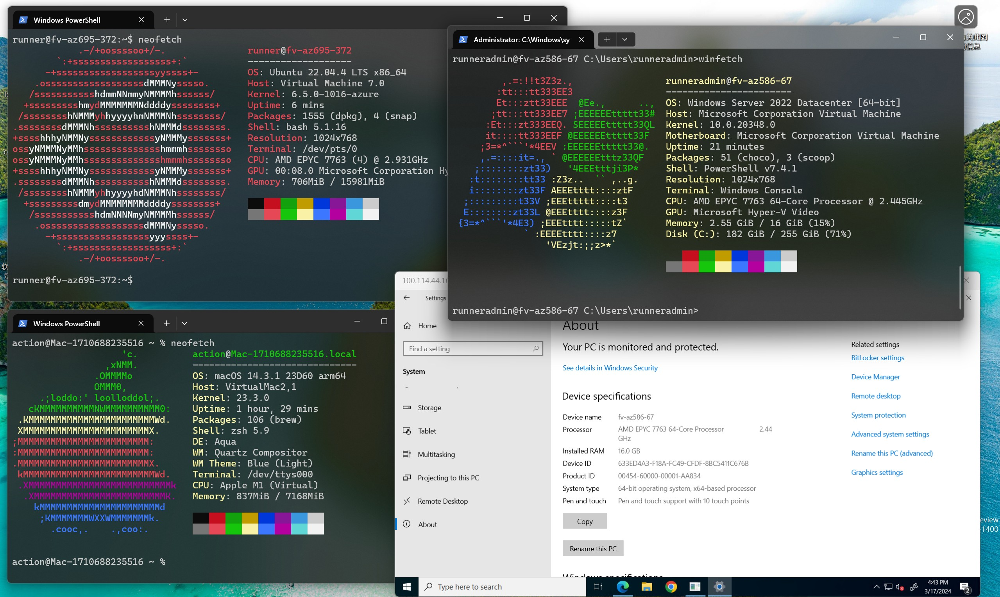

[English](README.md) | **中文**
# tailscale2actions
使用 Tailscale 通过 SSH 连接到临时的 GitHub Actions VM，可获取全端口的访问能力

支持: Ubuntu、MacOS、Windows(支持 RDP 登录)

Ubuntu/Windows: 4C + 16G RAM  
MacOS(ARM64): 3C + 8G RAM

单次使用时长上限为 6 小时

## 如何使用
1. 在本地客户端安装 Tailscale 并登录

2. Fork 此仓库

3. 在 "Settings" - "Secrets and Variables" - "Actions" - "Repository Secret" 添加一个仓库密钥用作 ssh 登录密码，名称为 "SSH_PASSWORD"，并填入你的密钥

4. 在 Actions 运行并检查工作流，等出现 `https://login.tailscale.com/a/xxxxxx` 后访问该链接以连接此 VM

5. 通过 `ssh [username]@[tailscale-ip]` 连接 GitHub Actions VM

## 致谢
- [Microsoft Azure](https://azure.microsoft.com)
- [GitHub Actions](https://github.com/features/actions)
- [Tailscale](https://tailscale.com)